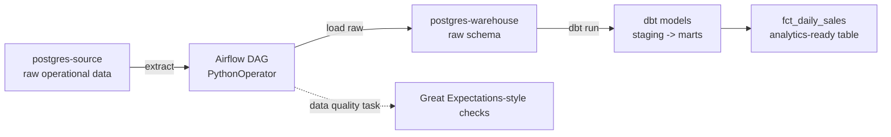

# Airflow Batch ETL Warehouse

A self-contained, Docker-based batch ELT pipeline for learning (or demonstrating) core data engineering orchestration skills: Airflow for scheduling/orchestration, Postgres as both source and warehouse, and dbt for in-warehouse transformations. Everything runs on your laptop with `docker-compose up` - no cloud account required.

## Who this is for

- Anyone learning Airflow + dbt and wanting a realistic, runnable reference project instead of a toy "hello world" DAG.
- Recruiters/engineers who want to see a complete, working ELT pattern rather than just pipeline code snippets.

## Architecture



1. **Extract** - Airflow's `extract_orders` task reads new rows from `postgres-source`.
2. **Load (raw)** - rows are loaded as-is into a `raw` schema in `postgres-warehouse` (ELT, not ETL - transformation happens after loading).
3. **Transform (dbt)** - a BashOperator triggers `dbt run`, which builds staging models (cleaned/typed) and mart models (daily sales fact table) directly in the warehouse using SQL.
4. **Test** - `dbt test` runs not-null/unique/relationship tests on the marts before the DAG marks the run successful.

## Tech stack

Apache Airflow (orchestration) · PostgreSQL (source + warehouse) · dbt-postgres (transformation & testing) · Docker Compose · Python (psycopg2 / pandas)

## Project structure

```text
airflow-batch-etl-warehouse/
├── docker-compose.yml
├── init/
│   └── source_init.sql        # seeds the source Postgres with sample "orders" data
├── dags/
│   └── etl_dag.py              # Airflow DAG: extract -> load raw -> dbt run -> dbt test
└── dbt_warehouse/
    ├── dbt_project.yml
    └── models/
        ├── staging/stg_orders.sql
        ├── marts/fct_daily_sales.sql
        └── schema.yml           # dbt tests & docs
```

## Getting started

```bash
git clone https://github.com/Kornelius99/airflow-batch-etl-warehouse.git
cd airflow-batch-etl-warehouse
docker-compose up -d
# wait ~30s for Airflow to initialise, then open http://localhost:8080 (user/pass: airflow/airflow)
# unpause and trigger the "batch_etl_warehouse" DAG from the UI or:
docker-compose exec airflow airflow dags trigger batch_etl_warehouse
```

Once the DAG completes, connect to the warehouse and inspect the result:

```bash
docker-compose exec postgres-warehouse psql -U wh_user -d warehouse -c "select * from marts.fct_daily_sales;"
```

## What this project demonstrates

Orchestration with dependency-aware DAGs, the ELT pattern (load raw, transform in-warehouse), dbt staging/marts layering, dbt testing/documentation, and a fully reproducible local data stack defined as code.

## Extending this project

- Swap the sequential executor for CeleryExecutor + Redis to practice distributed task execution.
- Add a sensor task that waits for new source files instead of running on a fixed schedule.
- Point dbt docs generation (`dbt docs generate && dbt docs serve`) to publish a browsable data catalog.

## License

MIT - see [LICENSE](LICENSE). Free to use, fork, and adapt for your own learning or portfolio.
